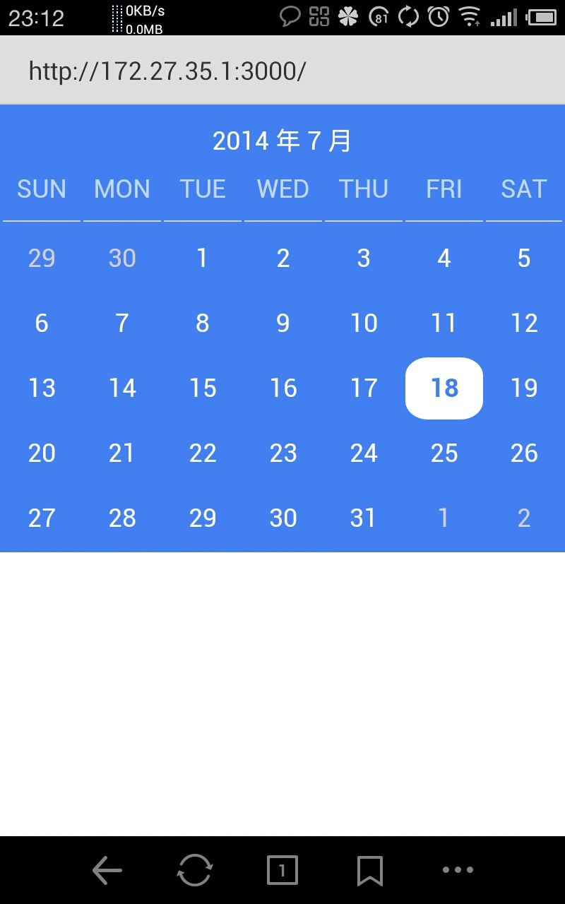
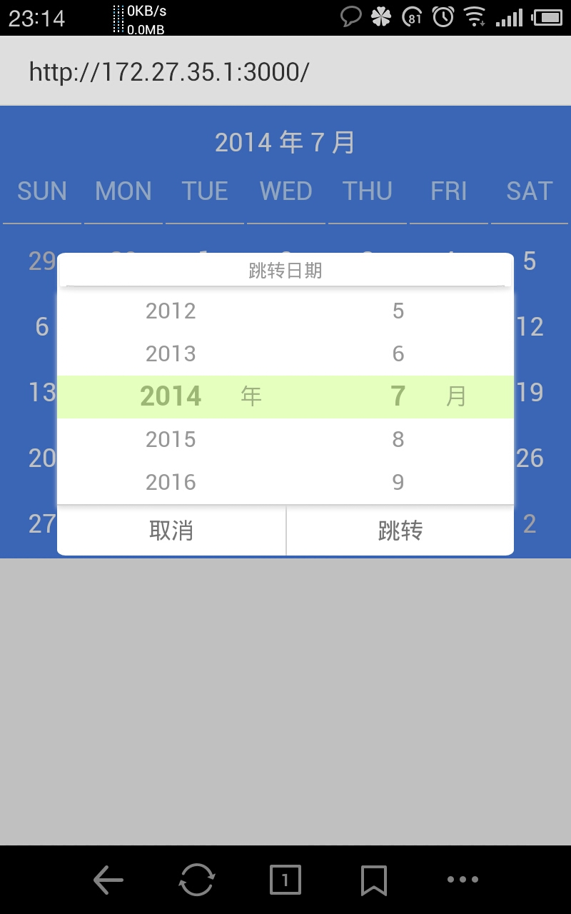
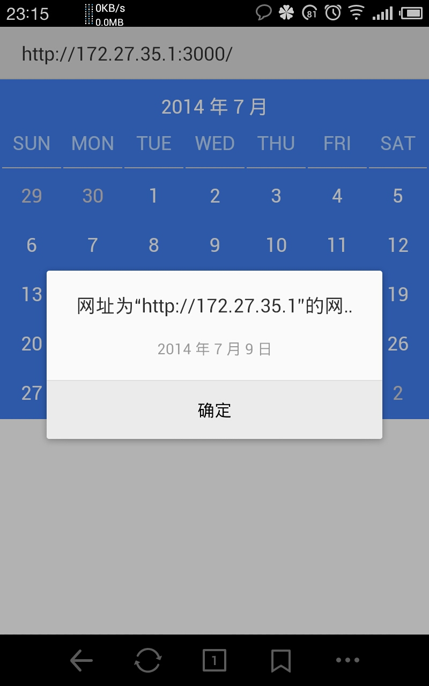

Calendar - 一个自制的移动web日历组件
==============================
##  查看效果
在线预览 ：http://gyj963.github.io/calendar/


可使用电脑或移动设备进行查看~

*注意：电脑浏览器查看请启用google的Emulate touch screen*

##功能介绍
手机效果截图（Android）：

*	滑动日历组件的日期部分可以切换上下月（向右滑：上个月，向左滑：下个月）



*	长按年月（截图中相应为【2014年7月】）可以跳转日期，上下滑动选择年和月。


*	如果需要，你可以自己编辑点击一个日期，执行的响应函数。



##  组件的使用
index.js即使用示例

详细说明：
引用public文件夹下javascript（除index.js外）及stylesheets中文件
在html文件中创建一个div并给其定义id（名字自定义），作为日历组件的容器，例如：
```{bash}
<div id="container">
</div>
```


接下来就可以调用相册组件啦，例如：
```{bash}
new PhotoAlbum({
	               "containerId":"container",   //   相册组件容器的id
	               "list":photolist,   //   图片路径对象列表
				   "size":120   //每个正方形缩略图的边长(单位：px)，可省（默认边长：100px）
               });
new Calendar({
	//   日历组件容器的id
	containerId:"container", 
	//   点击一个日期，执行的响应函数，可省
	selectDate:function(data){
		var year=data.year;
		var month=data.month;
		var date=data.date;
		alert(year+" 年 "+month+" 月 "+date+" 日");
	}
});
```


